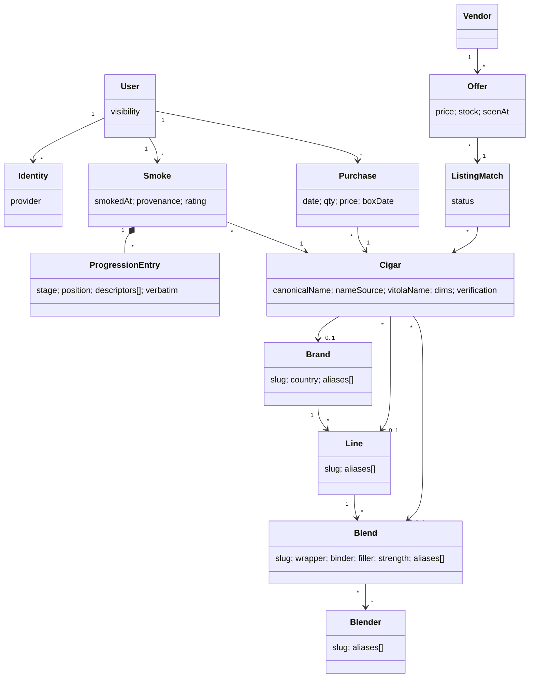

# Bounded Contexts and Aggregates

Logical modules inside one deployable (ADR-001). Boundaries are package
boundaries, not services.

## Contexts

- **Identity & Access** — Users, Identities, invites, sessions, and the OAuth
  authorization server used by MCP clients. Infrastructure-flavored; Better
  Auth owns its tables (ADR-004).
- **Journal** (core) — Smokes and everything inside them. The only context
  that writes Smokes.
- **Catalog** — Cigars and the brand/line/blend/blender reference entities
  above them (ADR-012); search/resolution; verification lifecycle. Written by
  curation, by crawl ingestion, and by the Journal context's lazy-create
  during `save_smoke`.
- **Market** — Vendors, crawls, Offers, Listing Matches, price history. Reads
  Catalog to match listings; proposes Catalog enrichment. Never writes Smokes.
- **Import** — one-shot legacy-archive migration tooling (ADR/flow 006). Uses
  Journal and Catalog public operations; owns no long-lived state.

## Aggregates

### Smoke (root — the system's center)

- **Contains:** Progression Entries (optional), overall Descriptors,
  Construction, Context, Assessment, Journal Entry (title + narrative),
  provenance-aware smoked-at, provenance, original imported markdown when
  applicable.
- **Why an aggregate:** all parts share one consistency boundary — a Smoke is
  saved and edited as a whole; nothing inside it is referenced from outside.
- **Invariants:** references exactly one Cigar (R2); owner immutable; rating
  ∈ [0,100] or null; progression positions ∈ [0,1] or null; minimum validity
  = cigar reference + at least one substantive field (progression, overall
  descriptors, narrative, or impression); imported originals never
  rewritten; progression append-only through edits.
- **Lifecycle:** `final` on creation in MVP (`draft` reserved for R12).
  Edits are field-scoped patches; every mutation writes an audit row in the
  same transaction (house pattern).
- **Transaction boundary:** one Smoke per transaction, plus lazy Cigar
  creation and the idempotency record in the same transaction.

### Cigar (root)

- **Why an aggregate:** shared reference data with its own lifecycle
  (verification, merge) independent of any Smoke.
- **Identity:** the leaf is **one blend in one vitola** — the thing you light
  (ADR-012). `canonicalName` (required, human-facing — "Atabey Divinos")
  remains the handle every FK and MCP contract sees, but it is a maintained
  projection: `name_source` is `freeform` (the string is authoritative) or
  `composed` (recomposed from brand + line + blend + vitola + edition).
- **Structure stores known facts; it never invents them.** Brand, Line, and
  Blend are nullable references; vitola name and dimensions sit on the leaf.
  A cigar whose line is unknown hangs directly off its brand, and unknown
  stays NULL. No field is fabricated to satisfy taxonomy (ADR-012 —
  superseding the earlier ruling that the hierarchy could not be modeled at
  all; the house rule survives, the prohibition does not).
- **Invariants:** canonicalName required; ancestry consistent wherever set
  (a Line's Brand is the leaf's Brand, a Blend's Line is the leaf's Line);
  blend metadata (manufacturer, wrapper/binder/filler origin, dimensions,
  release year — see [`domain-model-examples.md`](domain-model-examples.md))
  all nullable; `unverified` until curated or crawl-confirmed. Merging
  duplicates re-points Smokes, Purchases, and Listing Matches; merge is
  curator-only.
- Packaging is never identity: pack/bundle/tubo listings attach to the base
  leaf and their packaging facts live on the Offer (ADR-012).

### Brand / Line / Blend / Blender (Catalog reference entities)

- **Contains:** each carries a canonical name, a stable slug, and an alias
  list — `brands` (country, website, imagery), `lines` (under a Brand),
  `blends` (under a Line: wrapper/binder/filler, strength, blend notes,
  marketing photo), `blenders` (the person or team credited, many-to-many
  with Blends because collaborations exist and a blender's work spans
  brands).
- **Why aggregates:** each has its own identity, aliasing, and curation
  lifecycle, and they are what navigation, facets, and cross-vendor dedup key
  on — not string prefixes.
- **Invariants:** slug unique; aliases resolve to exactly one entity per
  level; a Blend's wrapper/binder/filler are a required *documentation
  target* (enrichment pursues them, a worklist tracks the gaps) but are never
  invented. Cuban blends typically credit no individual blender — that stays
  NULL, and blender-level views roll up NC-side only.
- A **vitola is not one of these** — it is a size label within a Blend,
  carried on the leaf as `vitolaName` + dimensions. There is no global vitola
  entity.

### User (root)

- Identities, invite state, journal visibility flag. Smokes and Purchases
  reference the User but live outside it (unbounded collections).

### Purchase (root)

- Simple record; references User + Cigar. No invariants beyond ownership —
  deliberately not folded into Smoke (a purchase is not an experience).

### Offer / Listing Match (Market)

- Offers are append-only observations keyed by (vendor, listing, crawl time) —
  a time series, not an aggregate with behavior. Listing Match is the mutable
  piece: `auto` → `confirmed`/`unmatched` via the curation queue.

## What is deliberately not modeled

Journal Entry as an aggregate (it is a representation of Smoke — the archive's
review-page model inverted this and it's the main thing being fixed); a global
Vitola entity (a size label within a Blend, not a thing with a lifecycle —
ADR-012); Flavor ontology (Descriptors are organic tags); Humidor/inventory
stock; domain events (no consumer yet — audit rows cover history; revisit if
Market needs reactive enrichment).

## Relationships

