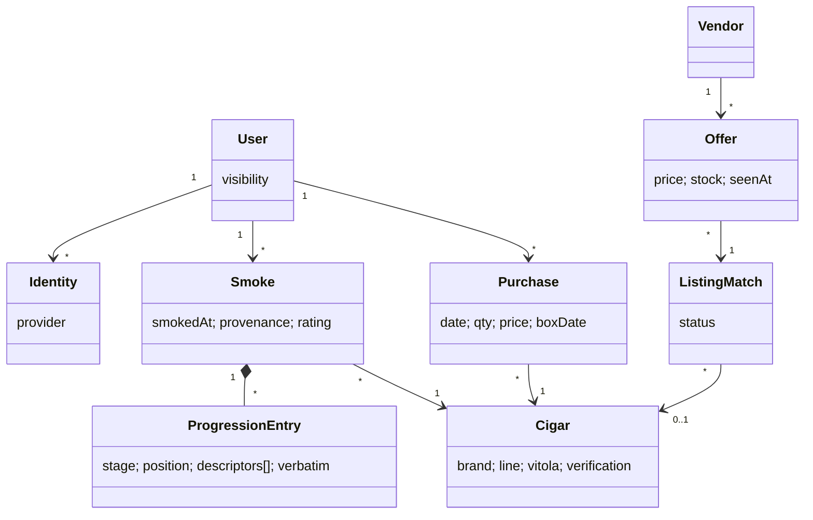

# Bounded Contexts and Aggregates

Logical modules inside one deployable (ADR-001). Boundaries are package
boundaries, not services.

## Contexts

- **Identity & Access** — Users, Identities, invites, sessions, and the OAuth
  authorization server used by MCP clients. Infrastructure-flavored; Better
  Auth owns its tables (ADR-004).
- **Journal** (core) — Smokes and everything inside them. The only context
  that writes Smokes.
- **Catalog** — Cigars, brands, vitolas; search/resolution; verification
  lifecycle. Written by curation, by crawl ingestion, and by the Journal
  context's lazy-create during `save_smoke`.
- **Market** — Vendors, crawls, Offers, Listing Matches, price history. Reads
  Catalog to match listings; proposes Catalog enrichment. Never writes Smokes.
- **Import** — one-shot legacy-archive migration tooling (ADR/flow 006). Uses
  Journal and Catalog public operations; owns no long-lived state.

## Aggregates

### Smoke (root — the system's center)

- **Contains:** Progression Entries, Construction, Context, Assessment,
  Journal Entry (title + narrative), provenance, original imported markdown
  when applicable.
- **Why an aggregate:** all parts share one consistency boundary — a Smoke is
  saved and edited as a whole; nothing inside it is referenced from outside.
- **Invariants:** references exactly one Cigar (R2); owner immutable; rating
  ∈ [0,100] or null; progression positions ∈ [0,1] or null; imported originals
  never rewritten.
- **Lifecycle:** `final` on creation in MVP (`draft` reserved for R12).
  Edits are field-scoped patches; every mutation writes an audit row in the
  same transaction (house pattern).
- **Transaction boundary:** one Smoke per transaction, plus lazy Cigar
  creation and the idempotency record in the same transaction.

### Cigar (root)

- **Why an aggregate:** shared reference data with its own lifecycle
  (verification, merge) independent of any Smoke.
- **Invariants:** brand + line required; vitola/size/wrapper nullable;
  `unverified` until curated or crawl-confirmed. Merging duplicates re-points
  Smokes, Purchases, and Listing Matches; merge is curator-only.
- Brands and vitolas are attributes/lookup values, not aggregates — they carry
  no behavior or lifecycle of their own.

### User (root)

- Identities, invite state, journal visibility flag. Smokes and Purchases
  reference the User but live outside it (unbounded collections).

### Purchase (root)

- Simple record; references User + Cigar. No invariants beyond ownership —
  deliberately not folded into Smoke (a purchase is not an experience).

### Offer / Listing Match (Market)

- Offers are append-only observations keyed by (vendor, listing, crawl time) —
  a time series, not an aggregate with behavior. Listing Match is the mutable
  piece: `auto` → `confirmed`/`unmatched` via the curation queue.

## What is deliberately not modeled

Journal Entry as an aggregate (it is a representation of Smoke — the archive's
review-page model inverted this and it's the main thing being fixed); Blend /
Tobacco Component (unknown for most cigars; nullable Cigar attributes suffice);
Flavor ontology (Descriptors are organic tags); Humidor/inventory stock;
domain events (no consumer yet — audit rows cover history; revisit if Market
needs reactive enrichment).

## Relationships

