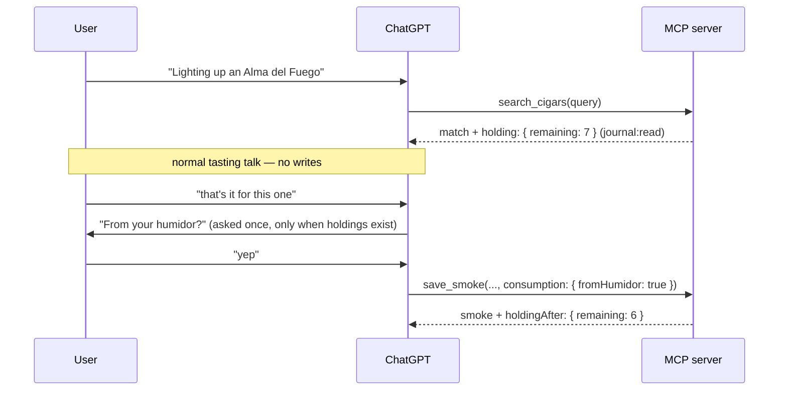

# DESIGN-002: Go-live experience — one catalog, the humidor overlay, honest prices

- **Status:** draft — proposals for owner sign-off
- **Date:** 2026-08-28
- **Scope:** the target UX between today's state (v0.14.x: poster library,
  separate Inventory page, heuristic holdings, near-empty seeded detail pages,
  offers rows with no UI) and launch. Builds on DESIGN-001's Humidor system.
  Requirements live in [PRD-003](../prd/003-unified-catalog-and-want.md);
  the consumption decision in [ADR-008](../adr/008-explicit-consumption.md).

## The owner's model (2026-08-28, verbatim north star)

> "The Catalogue should link to Inventory (which has detail about what I have
> in my house not about the product) and then Reviews deduct from Inventory
> and link back to the item in the Catalogue. … I can go to the Catalogue and
> see what I like regardless of whether or not it's in inventory. … we could
> collapse the catalogue and Inventory into one tool that has filters to show
> what I have, what I don't have, and what I 'Want'."

## Research: mechanics ported (surveyed 2026-08-28)

Search-verified against Vivino, Untappd, Letterboxd, Discogs, Wine-Searcher,
and CamelCamelCamel/Keepa help/feature documentation (consumer sites are
egress-blocked from the pod; mechanics were consistent across sources).

| Mechanic | Source | How it lands here |
|---|---|---|
| Have and Want are independent toggles, never mutually exclusive | Discogs collection/wantlist | Want survives acquisition and consumption; a holding can carry a want badge ("want more") |
| Consumption is an explicit per-event action, decoupled from rating | Vivino cellar "consume" | ADR-008: a smoke deducts only via a stated consumption link, asked once at save time |
| Personal state overlays the global catalog as combinable filters, not tabs or separate pages | Letterboxd Filters menu | One Catalog surface with an ownership facet; MCP browse takes composable booleans |
| Want clears at *acquisition*, by offer, never silently | inverted Letterboxd watchlist→watched; Untappd's keep-forever wishlist rejected | `record_purchase` and the web purchase path surface "still want it?" — one tap / one conversational beat |
| Unique-item count and session count are never conflated | Letterboxd Films vs Diary | `smokedCount` (all-time) stays distinct from `remaining` math, as today |
| Every price carries an as-of date; current offers never mix with what-I-paid; per-unit normalization; missing data is an explicit state | Wine-Searcher, Discogs sales stats, Camel/Keepa | Price panel rules below |
| Personalization is gated behind data volume and always inspectable | Vivino Match (activates after 5 ratings) | Suggestion surfaces are attribute-based shelves with truthful labels; no match score at launch |

Avoided: silent inventory decrement, exclusive Have/Want, per-state tabs,
"because you liked X" from one data point, stale prices dressed as live.

## IA: one catalog, three views

**Collapse Inventory into Catalog** (supersedes PRD-002 R-INV-1's separate
nav surface; the ledger table survives as a view). Nav is one non-wrapping
row that fits a 360–390pt phone: the **wordmark** ("Cigar Journal",
font-display) *is* the Journal link (`/`) — no separate Journal item — then
Catalog and Curation (admin only); the right cluster carries the record
action as an **icon-only** accent chip (no text at any width) and Sign out.
Inventory is gone.

> **Superseded (nav row only).** Curation and Sign out left the nav row for
> the avatar-initials user menu; see DESIGN-003 §"Chrome: user menu" for the
> shipped composition. The wordmark-is-Journal rule and the icon-only record
> chip stand.

- **Views:** Brands (default) · All · Ledger. Brands and All are the
  existing poster library. **Ledger** is the purchases-lots table moved from
  `/inventory?view=table`, plus a per-holding consumed/remaining column —
  the desk-work surface for dates, PPS, box codes, and count reconciliation.
  **Ledger columns:** the identity and count columns (Cigar, Brand, QTY,
  Consumed, Left, Purchased, Vendor, PPS) always render because they are what
  the desk scans by; the descriptive ones (Packaging, Vitola, Type, Size,
  Humidor, Box date, Aging) render only when a row carries a value, the same
  absent-when-empty rule the humidor panel applies.
- **Ownership facet** (All view and Brands): `All · Have · Want · Don't
  have`. Definitions: Have = explicit `remaining > 0`; Want = flagged;
  Don't have = no active holding (previously-owned-and-emptied included —
  the ledger is where the distinction lives). Exclusive segments on the web
  toolbar (one control, honest and small); the MCP browse tool exposes the
  same states as independent booleans so an agent can compose "want AND not
  have AND in stock."
- **Facet mechanics on Brands:** an active facet filters the wall to brands
  with ≥1 matching cigar and re-badges tile counts to the matching subset.
  The level registry (PRD-002 conventions) declares which facets each level
  answers; Ledger takes no ownership facet (it *is* the Have detail).
- **Sorts on All:** name · my rating · recently added · price. Price sorts
  by best current per-stick offer; cigars without a current offer sort
  after the priced ones under an explicit "no current offer" break — never
  interleaved as zero.
- **Root shelves** above the brand wall, deterministic and truthfully
  labeled, each a link into the faceted All view: *In your humidor* (by my
  rating), *Wanted*, *Recently added*. No shelf renders empty; absent data
  removes the row (Whiskybase rule).
- **Redirects:** `/inventory` → `/cigars?own=have`; `/inventory?view=table`
  → `/cigars?view=ledger`. Old links keep working.

Rationale for one surface over two: every Inventory capability is a filter
or a view of catalog rows (the research pattern), the owner asked for it,
and two poster grids of the same tiles with different membership was already
a consistency liability. The ledger keeps its identity as a *view* because
its job (lot-level desk work) genuinely differs from browsing.

## Cigar detail page — the rebuild

Composition order, every section absent-when-empty (no-blurbs rule). The
test case is a crawl-seeded cigar the owner has never touched: today that
page is name + chip + photo; under this design it is photo + vitals + price
+ want + record action — already worth visiting.

1. **Hero.** ProductPhoto in the parchment plate (or BandTile), name,
   verification chip, **Want toggle**, and the **Record a smoke** action
   (links `/smokes/new?cigarId=…`, which pre-resolves the picker — PRD-002
   R-INV-3's missing half). The plate is one 3:4 framed box for both arms —
   the photo contained on the plate ground, the BandTile filling the
   identical frame — so the hero's structure never varies with photo luck
   (`HeroPlate`, shipped 2026-09-01; closes the #218 two-heroes finding).
2. **Vitals + blend.** As today.
3. **Price.** One row per vendor with a current offer: vendor · per-stick
   price (normalized when packaging is known, else the raw price labeled
   with its packaging) · stock state · seen date · link-out to the listing.
   Best per-stick price leads. Rules: every figure carries its as-of date;
   offers older than the staleness window (30 days, tunable) render muted
   with the date still explicit; no current offer = section absent on
   seeded cigars that never matched, or an explicit "No current offers."
   line when offers existed before; unapproved-source data is labeled
   (ADR-006). **Price history**: a small line under the panel only when ≥3
   observations span ≥2 distinct days; below that, first/last-seen text.
   Never a fake axis (burn-line rule). What-I-paid (PPS) never appears
   here — it belongs to the humidor panel.
4. **Your humidor** (when holdings exist). Remaining as the hero number,
   aging since, then the lots mini-ledger (qty · purchased · vendor · PPS ·
   box date), a discrepancy line when consumption exceeds acquisitions
   (links to the correction path, ADR-008), and **Smoke one** — the record
   form pre-resolved with from-humidor defaulted on.
5. **Your history.** The personal-profile card, as today.
6. **Your smokes.** As today; a smoke with a consumption link carries a
   small "humidor" tag so provenance reads at a glance.

Links both ways, closing the owner's loop: journal entry → cigar (exists) →
humidor panel (new) → smoke one → new entry → deducts → back on the same
page.

## Want

- **Semantics:** independent personal mark on a catalog cigar. Never
  auto-cleared by smoking; acquisition *offers* the clear (web: the badge
  with a one-tap clear on the purchase confirmation and holding views; MCP:
  `record_purchase` returns `wanted: true` and the model asks).
- **Data:** `wants` (user_id, cigar_id UNIQUE pair, optional note,
  created_at). Named lists are the documented extension: `wants` becomes
  the seeded system list when lists arrive; nothing in v1 blocks that
  migration (PRD-003).
- **Surfaces:** detail-page toggle, tile badge, ownership facet, root
  shelf, MCP `set_want` + read overlays.

## Explicit consumption — the flows (ADR-008)

**Web record:** resolve cigar → when the caller holds it, the form shows
"From my humidor" defaulted on (`remaining > 0`); a lot select appears only
when lots are distinguishable (differing box date/code) and defaults to
unattributed. Edit form exposes the same block.

**MCP conversational flow:**



Omitted `consumption` = unknown = no deduction (the schema never forces the
model to invent provenance). If the user already said where the stick came
from ("grabbed one from the humidor" / "at the lounge"), the model skips the
question and records what was stated.

## MCP surface for ChatGPT

**New tools (3):**

- `browse_catalog` — paged catalog browse with composable filters: `q`,
  `brand`, `type`, `inHumidor?`, `wanted?`, `smoked?`, `inStock?`, `sort`
  (name | my-rating | recently-added | price), cursor/limit. Returns tiles
  with the personal overlay and price-at-a-glance. This is the tool that
  answers "what do I want that's in stock under $15/stick."
- `get_offers` — current offers for one cigar (vendor, price, per-stick
  where known, stock, seenAt, url, approved flag) + compact history
  (first/last seen, min/max). Kept out of `get_cigar` to protect its token
  budget; `get_cigar` gains only a one-line `bestOffer`.
- `set_want` — idempotent write (`cigarId`, `wanted: boolean`, optional
  `note`), standard mutation envelope.

**Changed tools:** `save_smoke` + `update_smoke` gain the `consumption`
block; `search_cigars`/`get_cigar` gain `holding { remaining }` and
`wanted` under `journal:read`; `record_purchase` result gains `wanted`;
`get_my_inventory.remaining` becomes the explicit count (heuristic wording
deleted). Server instructions gain the ask-once consumption rule and the
want vocabulary.

**Contract stability:** additive-only changes; all schema edits for a
feature land in one deploy; after any tool-schema deploy the connector is
refreshed once and a *new* chat started (ChatGPT caches schemas
per-conversation — client-compatibility.md); tool descriptions stay inside
the ~5k-token bound.

**Conversations this enables:** "what should I smoke tonight"
(get_my_inventory, sorted by my rating); "put the Opus on my want list"
(set_want); "what's on my want list that's in stock" (browse_catalog);
"what's a good price for X" (get_offers, with seen dates the model can
quote honestly); "I'm done — yes, from the humidor" (save_smoke).

**Suggest-what-to-try-next: the data surface, not the recommender.**
Everything a future suggester needs ships with this design: catalog
attributes + price via `browse_catalog`/`get_offers`, taste via
`personalProfile` and descriptor queries, ownership via the overlay. Any
future match score is gated behind a data threshold (the Vivino rule) and
must cite its basis; until then, suggestion surfaces are truthful attribute
shelves ("more from this brand", "similar strength"), never "because you
liked X" from one data point.

## Look and feel — component guidance

**Already in hand (DESIGN-001):** the token layer (espresso/paper,
single amber accent, tobacco ramp), `label-caps`, `prose-ledger`, BandTile,
RatingSeal, StrengthMeter, VitalsBlock, Chips, the segmented-control
pattern (aria-pressed, label-caps), URL-state toolbar, keyset pagination.

**New components, on those tokens (no new colors, no icon system):**

- `WantToggle` — chip-shaped control: `ui.chipOutline` unset, accent-filled
  (`bg-accent text-accent-ink`) when set; `aria-pressed`; a static variant
  renders the tile badge. The want mark spends the single accent — that is
  what the accent is reserved for (meaning), and it is why want gets no
  second color.
- `PricePanel` / `OfferRow` — tabular numerals; per-stick figure leads with
  its unit label; seen date in `label-caps`; stale rows keep their date and
  drop to `text-muted`; vendor name is the link-out. One row per vendor,
  best first.
- `PriceSpark` — honest-degradation mini line (rules above); ash/ember
  materials, not the accent.
- `HoldingPanel` — remaining as a `font-display` hero number ("7 left"
  pattern from the inventory grid), lots as a compact ledger table.
- `OwnershipFacet` — the existing segmented control, one more instance.
- `LedgerTable` — lifted from `/inventory`, plus the consumed/remaining
  column and discrepancy styling (`text-danger` only when consumption
  exceeds acquisition — a real problem, not decoration).

**Tile badge-row discipline** (cap three, PRD-002): priority when present —
remaining count ("×7") · want · rating seal; dims yield first, smoked-count
folds into the detail page. A tile never shows both an ownership facet's
implied state and a redundant badge (under the Have facet, every tile
showing "Have" would be noise; the count is the information).

**Honest degradation, restated for the new surfaces:** no offers → no price
section; no holdings → no humidor panel; no photo → BandTile, never a
broken image; facet with zero matches → the standard "No matches." line
(an unrefined catalog root that is empty says `No cigars yet.` instead —
"matches" presumes a query);
price history below threshold → text, not chart.

**Mobile:** the toolbar stays one fixed-height row that pans; facet
segments join it; panels stack in composition order; the ledger keeps
horizontal scroll (PRD-002 R-X-1).

**Wait states (owner rule, 2026-08-29):** every asynchronous affordance
shows a busy label while work is in flight — "Uploading…" on photo tiles,
in-place dimming plus skeletons on refetching grids. A pending action is
never visually idle, and a completed flow always offers a next step (the
upload page links to the smoke after "Added."); no dead ends.

## UI strings — PROPOSALS (Fable-lane review before implementation)

Implementers use these exactly or flag the gap; never invent alternates.

| Surface | Proposed string |
|---|---|
| Nav row | wordmark (→ Journal) · `Catalog` · `Curation` (admin) · [record icon] · Sign out — superseded, see DESIGN-003 §"Chrome: user menu" |
| Journal h1 (`/` and `/journal`) | `Journal` — approved and shipped |
| Record icon button | pencil SVG (Feather edit-3), `aria-label`/`title` = `Record a smoke` |
| View toggle | `Brands` · `All` · `Ledger` |
| Ownership facet | `All` · `Have` · `Want` · `Don't have` |
| Want toggle (unset/set) | `Want` (same label both states; fill signals state) |
| Record action (hero) | `Record a smoke` |
| Humidor panel action | `Smoke one` |
| Record form control | `From my humidor` |
| MCP ask-once beat | `From your humidor?` |
| Price section heading | `Price` |
| Offer seen date | `seen Aug 12` (month + day; year when not current) |
| No offers (had some before) | `No current offers.` |
| Holding hero | `7 left` |
| Aging line | `since Jun 2025` (existing pattern) |
| Purchase clear affordance | want badge + `Clear` |
| Shelf headings | `In your humidor` · `Wanted` · `Recently added` |
| Smoke-list provenance tag | `humidor` |
| Photo tile busy state | `Uploading…` |
| Upload page after success | `Added.` + `Open the smoke` |
| Ledger columns | the current inventory-table columns plus `Consumed` and `Left` |
| Ledger discrepancy cell | `N over` (danger tone; `title="Consumption exceeds recorded purchases"`) |
| Detail humidor discrepancy line | `N over — consumption exceeds recorded purchases` (danger tone, links the Ledger; the panel line carries the explanation visibly — a title tooltip is unreachable on touch) |
| Favorite toggle (unset/set) | `Favorite` (same label both states; ember-heart fill signals state — the second cigar-level mark, owner-approved 2026-08-28) |
| Lot picker | label `Lot`; `—` is the unattributed option |
| Type facet (Brands + All) | `Both` · `NC` · `CC` (owner-approved on Brands too) |
| Empty grid (refined) | `No matches.` |
| Empty catalog root (unrefined) | `No cigars yet.` — approved 2026-09-01 |

**Empty-state grammar (owner-approved 2026-09-01):** accumulating surfaces
say `No ‹thing› yet.` (`No smokes yet.`, `No inventory yet.`, `No cigars
yet.`, `Not in the catalog yet.`); refined views say `No matches.`;
worklists that drain to done say `Nothing ‹state›.` (`Nothing unverified.`).
One predicate separates the grid families: any refinement present — search,
facet, type, chip, or drill — selects the matches grammar
(`catalogEmptyLine` in the catalog registry).

## Owner decisions (2026-08-28)

Unified surface, ADR-008, and Want v1 approved as designed; the four open
questions below resolved to their recommended defaults.

## Open questions for the owner (resolved — defaults taken)

```yaml
- question: Facet label "Don't have" vs "Not owned"
  recommendedDefault: "Don't have" — matches his own words
- question: Does Ledger deserve a nav shortcut, or is the view toggle enough?
  recommendedDefault: view toggle only; revisit if desk sessions say otherwise
- question: Want note (free-text "why") in v1 UI, or MCP-only until lists?
  recommendedDefault: MCP + detail page display; no input field on tiles
- question: Staleness window for offer display (30d proposed)
  recommendedDefault: 30 days, revisit once the re-crawl cadence is real
```
