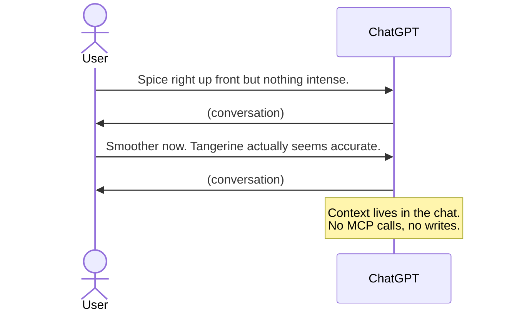
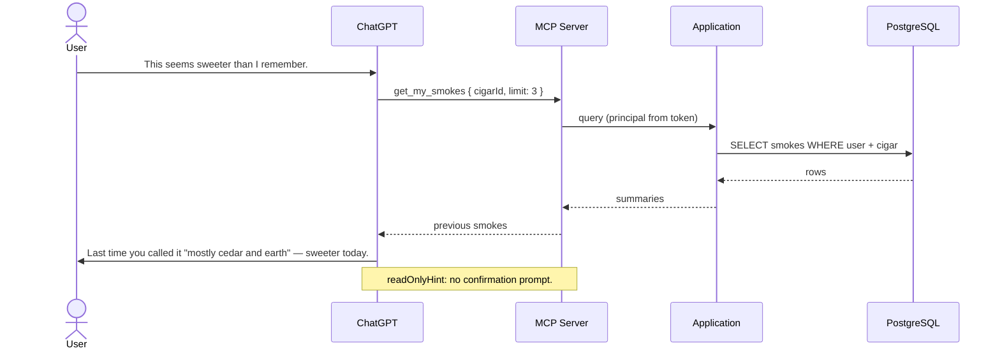
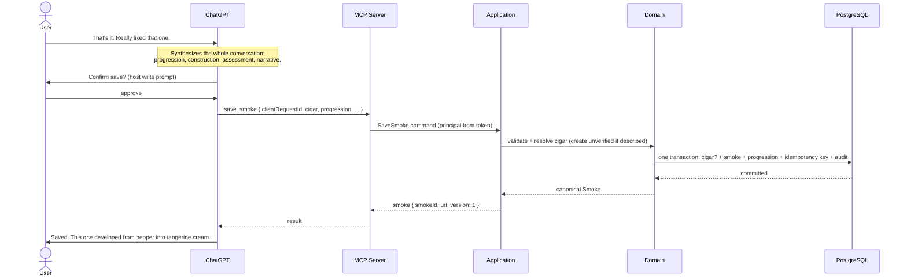

# Flow: Smoking Session

- **Trigger:** the user starts discussing a cigar with an LLM client
  (ChatGPT Web). Finalization triggers on the user signaling the smoke is
  over.

## Ordinary conversation — no backend traffic

The defining property: tasting talk stays between user and model. The backend
sees nothing until a tool is genuinely useful.

## Mid-conversation history retrieval

## Finalize

## Failure modes

- Cigar unresolvable/ambiguous → [flow 002](002-cigar-resolution.md).
- Timeout/retry → [flow 004](004-idempotent-retry.md).
- Write tools unavailable → model emits the `save_smoke` payload as text;
  user pastes it into the site's import page (tool contract, fallback).
