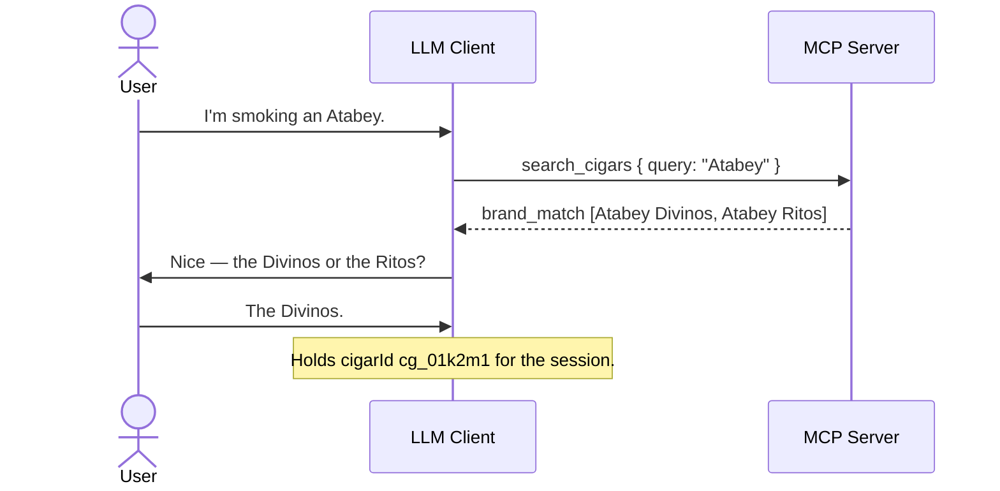

# Flow: Cigar Resolution

- **Trigger:** a cigar is named conversationally — usually partially
  ("Alma Fuego", "Atabey") — and the model needs a catalog reference.

## Sequence

1. Model calls `search_cigars` with the user's phrasing; trigram matching
   tolerates partial names and misspellings.
2. `single_match` → proceed with the `cigarId`. Emitted when the top hit is an
   exact (case-insensitive) canonical-name match — trailing fuzzy hits stay
   listed — or a single fuzzy candidate stands alone. No user interruption.
3. `brand_match` → the query named only a known brand, not a product. `matches`
   are that brand's catalogued cigars; the model asks for the line/vitola
   before resolving.
4. `multiple_matches` → several fuzzy candidates and no clean winner; the model
   disambiguates *conversationally* (vitola usually settles it). Never guesses.
5. `no_match` → no interruption mid-smoke; at finalize, `save_smoke` carries
   `described` attributes — `canonicalName` as the user knows it, plus brand,
   line, blend, and vitola only where the user actually stated them — and the
   server creates an `unverified` catalog entry inside the save transaction
   (catalog invariant, ADR-002/006). Stated levels resolve against the brand
   and line registries by alias (ADR-012); unstated levels stay NULL and the
   row stays `freeform` until curation composes it. The curation queue picks
   it up later. No line, blend, or vitola detail is ever invented to fill a
   level.

## Aggregates and invariants

Catalog Cigar only. Server-side strong-match check prevents `described` from
duplicating an existing entry (`cigar_ambiguous` if it can't decide);
verification/merge stay curator-only. The strong-match check also guards
against collapsing number-distinct names: a candidate whose digit/alphanumeric
model tokens conflict with the query's (e.g. "1964 Maduro" vs "1926 Maduro",
"Liga Privada T52" vs "…No. 9") is disqualified from strong-linking even at a
high trigram score, so it creates a new entry rather than mislinking.

## Failure modes

- `cigar_ambiguous` at save time → model asks the user, retries with the
  chosen id and the **same** `clientRequestId`.
- Model invents a `cigarId` → `cigar_not_found`, recoverable via search.
