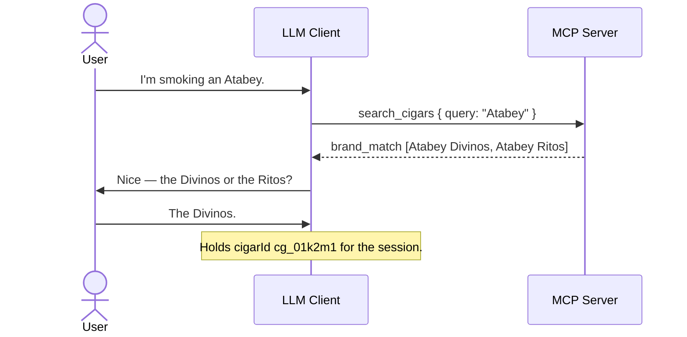

# Flow: Cigar Resolution

- **Trigger:** a cigar is named conversationally — usually partially
  ("Alma Fuego", "Atabey") — and the model needs a catalog reference.

## Sequence

1. Model calls `search_cigars` with the user's phrasing; trigram matching
   tolerates partial names and misspellings.
2. `single_match` → proceed with the `cigarId`. Emitted when the top hit is an
   exact (case-insensitive) canonical-name match — trailing fuzzy hits stay
   listed — or a single fuzzy candidate stands alone. No user interruption.
3. `brand_match` → the query named only a known brand, not a product. `matches`
   are that brand's catalogued cigars; the model asks for the line/vitola
   before resolving.
4. `multiple_matches` → several fuzzy candidates and no clean winner; the model
   disambiguates *conversationally* (vitola usually settles it). Never guesses.
5. `no_match` → no interruption mid-smoke; at finalize, `save_smoke` carries
   `described` attributes — `canonicalName` as the user knows it, plus brand,
   line, blend, and vitola only where the user actually stated them — and the
   server creates an `unverified` catalog entry inside the save transaction
   (catalog invariant, ADR-002/006). Stated levels resolve against the brand
   and line registries by alias (ADR-012); unstated levels stay NULL and the
   row stays `freeform` until curation composes it. The curation queue picks
   it up later. No line, blend, or vitola detail is ever invented to fill a
   level. The **documented** path is `add_cigar` first and then the save
   (server instructions; owner ruling on issue #177); the described save is the
   resolver's safety net for a client that skipped that prelude, so the entry
   survives either way. What must never happen is stopping at `add_cigar` — it
   writes no journal entry, and a catalog row without one looks like success
   (#177, a live loss on 2026-08-30). Only a save that actually *creates* the
   entry queues its enrichment; one that links to an existing row filled no gap.

## Aggregates and invariants

Catalog Cigar only. Server-side strong-match check prevents `described` from
duplicating an existing entry (`cigar_ambiguous` if it can't decide);
verification/merge stay curator-only. The strong-match check also guards
against collapsing number-distinct names: a candidate whose digit/alphanumeric
model tokens conflict with the query's (e.g. "1964 Maduro" vs "1926 Maduro",
"Liga Privada T52" vs "…No. 9") is disqualified from strong-linking even at a
high trigram score, so it creates a new entry rather than mislinking.

The same disqualification applies to **word** identity tokens, and nothing about
the number rule was ever specific to digits. Each name is read as identity plus
vocabulary: strike the tokens the two names share, then the sizes, containers and
wrappers each judged by their own rule, and what remains is that name's identity
residue. Two non-empty residues are two different products — "Tatuaje Monster
Series The Face" is not "…The Bride", however many characters they share — and
the pair may not strong-link (production, 2026-08-30: `add_cigar` for The Face
returned `created: false` against The Bride).

**A described name links only to a row making the same identity claims**
(2026-09-01). Any residue at all — on the name, on the row, or both — and any
*stated* wrapper disagreement raises `cigar_ambiguous`; number and packaging
disagreements still create. A one-sided residue used to link, on the reasoning
that the shorter name said strictly less, until production showed the cost: the
catalog held "Atabey Ritos", `add_cigar` for "Atabey Black Ritos" — a different
blend — left the residue `{black}` on the query side alone and silently linked,
and a link carries smoke history, ratings, inventory, prices and enrichment onto
the wrong product. That allowance was written when the only alternative was
minting a near-twin row; the ask branch now exists, so the question costs a round
trip and the silent link costs data. Vocabulary is still not identity — sizes,
containers and wrappers are struck before either residue is built — so a name
adding only a size word, or a wrapper the row does not state, still links.

Residues are compared on SPELLINGS, not on strings. One word written two ways —
`Ecuador`/`Ecuadorian`, `San Andres`/`Mexican`, `Shade Grown`/`Shadegrown`,
`Anniversary`/`Aniversario`, `Edicion`/`Edition` — is one word, folded onto a
single key by the equivalence table the vocabulary sets carry (ADR-012
§Decision). Equivalence is a table and never a distance: over this catalog's own
tokens, edit distance 1 pairs `Face` with `Farce`.

A near-match rejected by the identity or wrapper rule ALONE is neither linked nor
created: it raises `cigar_ambiguous` with the siblings as candidates, because the
residue is too weak a signal to decide silently in either direction and the user
is the one who knows. A number or packaging rejection still creates — those names
state a structured difference, so there is nothing to adjudicate.

Candidate lists put the identity VERDICT first: a name that contradicts the query
— a residue on both sides — sorts below every name that merely says more or less,
whatever its trigram score, so among fourteen siblings of one family the one the
user named is offered first instead of buried. Below that verdict the residue is
a coarse signal and is treated as one, with trigram deciding between candidates
whose identity claims are comparable. `search_cigars` and `resolveCigar` draw the
same fifty-row candidate pool: ranking cannot recover a row the pool never held,
and a family is bigger than a page.

**Specialization** (ADR-017). A row with `vitola_name NULL` is a FAMILY ROW — the
vitola was never recorded, not a claim that there is none. When the described
cigar states `vitola.name` and the single strong candidate is such a row, the
resolver does not link: it gets-or-creates the SIBLING leaf under the family's
own `brand_id`/`line_id`/`blend_id` and free-text brand/line, carrying the stated
vitola and its dimensions, named as the user named it when that name already
carries the vitola and `<family name> <vitola>` otherwise. The result adds
`specializedFrom: { cigarId, canonicalName }` — the family row it was minted
under — and `created` says whether the sibling was new. The rule keys on the
FIELD, not on a word in the name: a size word in `canonicalName` alone stays
vocabulary and still links, a candidate whose RECORDED vitola differs from the
stated one is a different product and creates as before, and a described cigar
that states no vitola links to the family row as it always did. The family row is
never retyped, so the smokes and lots already on it keep the attribution they
were given; each moves with `update_smoke` or `update_purchase`, one at a time.

## Failure modes

- `cigar_ambiguous` at save time → model asks the user, retries with the
  chosen id and the **same** `clientRequestId`. Re-issuing the same call is safe
  under the same id: the ambiguity is raised inside the transaction, so nothing
  was written and the key was never recorded. When the user confirms none of
  the candidates is theirs, the deadlock breaks with `confirmedDistinct: true`:
  on `add_cigar`, whose `cigarId` the save then runs against — the turn still
  ends with the save — or, when the ambiguity arose on `record_purchase`, on
  that call itself, which resolves and lands the purchase in one go. The flag
  lives on those two tools only; `save_smoke` never sets it.
  **The `add_cigar` detour SPENDS that `clientRequestId`.** Keys are unique per
  user and id, not per tool, so the save that follows the detour must carry a
  FRESH one — reusing the spent id is a different payload under a recorded key,
  which is `idempotency_conflict` and is not recoverable. One id per mutation,
  not one per turn: a retry of the same call keeps its id, a second tool call
  takes its own.
- Model invents a `cigarId` → `cigar_not_found`, recoverable via search.
