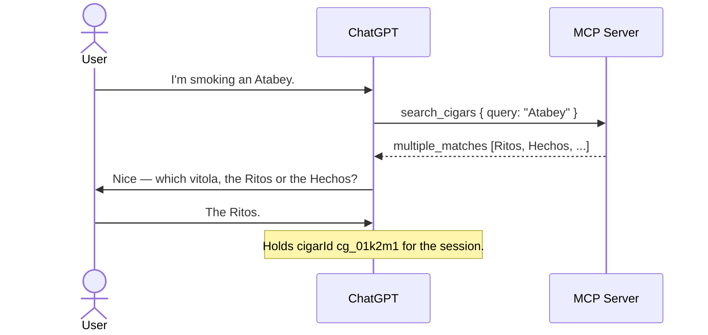

# Flow: Cigar Resolution

- **Trigger:** a cigar is named conversationally — usually partially
  ("Alma Fuego", "Atabey") — and the model needs a catalog reference.

## Sequence

1. Model calls `search_cigars` with the user's phrasing; trigram matching
   tolerates partial names and misspellings.
2. `single_match` → proceed with the `cigarId`. High-confidence single result
   needs no user interruption.
3. `multiple_matches` → the model disambiguates *conversationally* (vitola
   usually settles it), then proceeds. Never guesses.
4. `no_match` → no interruption mid-smoke; at finalize, `save_smoke` carries
   `described` attributes and the server creates an `unverified` catalog
   entry inside the save transaction (catalog invariant, ADR-002/006). The
   curation queue picks it up later.

## Aggregates and invariants

Catalog Cigar only. Server-side strong-match check prevents `described` from
duplicating an existing entry (`cigar_ambiguous` if it can't decide);
verification/merge stay curator-only.

## Failure modes

- `cigar_ambiguous` at save time → model asks the user, retries with the
  chosen id and the **same** `clientRequestId`.
- Model invents a `cigarId` → `cigar_not_found`, recoverable via search.
