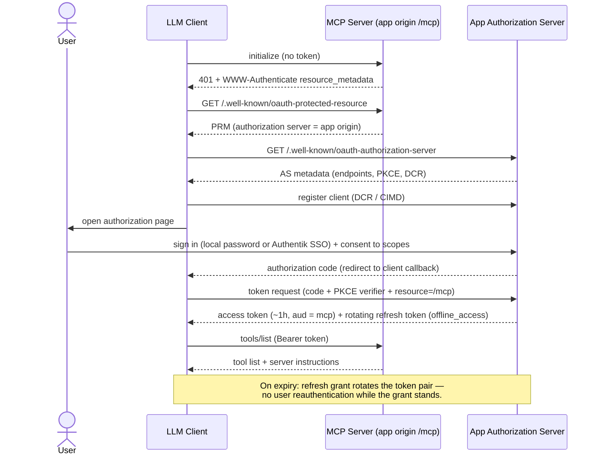

# Flow: MCP Authorization

- **Trigger:** a user links the connector in an MCP client (ChatGPT
  Developer Mode, Claude Code, Codex), or a token expires.

The diagram shows the architecture; the exact handshake belongs to the
official MCP SDK's protocol negotiation (2025-11-25 revision at time of
writing) — nothing here hand-rolls the lifecycle (ADR-005).

## Invariants

- The token's subject **is** the principal; every application command derives
  ownership from it. No tool argument can name a user.
- Tokens are audience-bound (RFC 8707) — a web session token is not valid at
  `/mcp` and vice versa.
- Registered redirect URIs only (ChatGPT publishes two; other clients
  theirs); state + PKCE enforced; consent screen shows scopes in plain
  language.
- Revocation: disconnecting the connector (or the site's "connected apps"
  page) invalidates the refresh chain; access tokens are short-lived.

## Failure modes

- Expired access token → refresh grant; expired/revoked refresh token → 401
  → client re-runs the full flow. Real per-client refresh behavior is a
  **Phase 0 spike** question.
- Consent denied → connector unlinked, nothing stored.
- Wrong-audience or tampered token → `unauthenticated`, logged with
  correlation id, no detail leaked.
