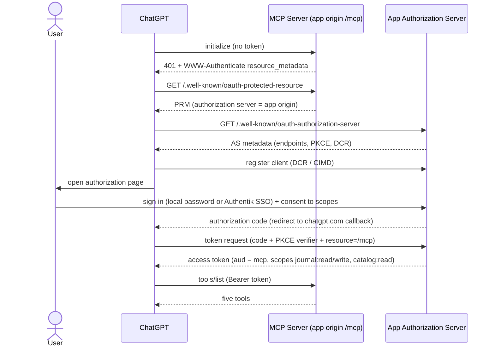

# Flow: MCP Authorization

- **Trigger:** a user adds the connector in ChatGPT (Developer Mode), or a
  token expires.

## Sequence

## Invariants

- The token's subject **is** the principal; every application command derives
  ownership from it. No tool argument can name a user.
- Tokens are audience-bound (RFC 8707) — a web session token is not valid at
  `/mcp` and vice versa.
- Both ChatGPT redirect URIs registered; state + PKCE enforced; consent
  screen shows scopes in plain language.
- Revocation: disconnecting the connector (or the site's "connected apps"
  page) revokes the grant; tokens are short-lived.

## Failure modes

- Expired token → 401 → ChatGPT re-runs the flow (refresh behavior is
  UNVERIFIED platform-side; validate real reconnects in Phase 4).
- Consent denied → connector unlinked, nothing stored.
- Wrong-audience or tampered token → `unauthenticated`, logged with
  correlation id, no detail leaked.
