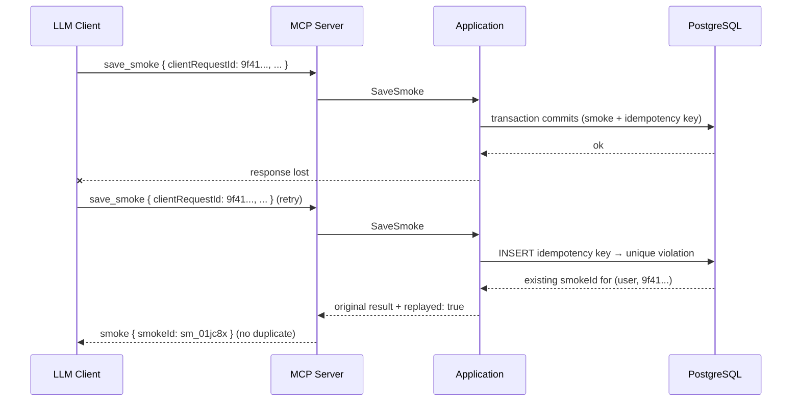

# Flow: Idempotent Retry

- **Trigger:** a mutation response is lost (timeout, network) or the user
  says "save that" twice; the client or model retries. Applies identically
  to `save_smoke` and `update_smoke` — every mutation carries the envelope.

## Sequence

## Invariants

- `(user_id, client_request_id)` is UNIQUE; the key row — including a
  fingerprint of the canonicalized arguments and the committed result —
  lands in the same transaction as the mutation. There is no window where
  the effect exists without its key.
- The model mints `clientRequestId` once per intent and reuses it exactly on
  any retry (tool contract); host-level retries resend identical arguments,
  so the key travels automatically.
- Replay detection is fingerprint-checked: same key + same fingerprint →
  stored result, `replayed: true`. This is what makes
  `update_smoke.progression.append` retry-safe — a replayed append returns
  the original result instead of appending twice.
- A *different* key with near-identical content is a new Smoke by design —
  the same cigar smoked twice in an evening is legitimate. No content-based
  dedup heuristics.

## Failure modes

- Same key, **different** arguments → `idempotency_conflict`
  (non-recoverable): the model must mint a new id for a genuinely new
  intent; corrections go through `update_smoke`, not divergent replays.
- Crash before commit → no key, no effect; the retry simply succeeds.
