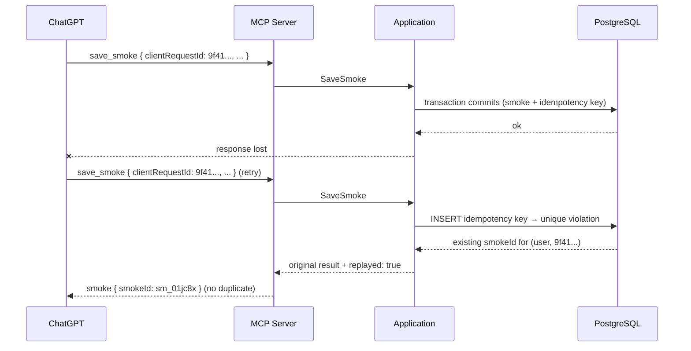

# Flow: Idempotent Retry

- **Trigger:** a `save_smoke` response is lost (timeout, network) or the user
  says "save that" twice; the client or model retries.

## Sequence

## Invariants

- `(user_id, client_request_id)` is UNIQUE; the key row commits in the same
  transaction as the Smoke — there is no window where the smoke exists
  without its key.
- The model generates `clientRequestId` once per smoke and reuses it exactly
  on any retry (tool contract); host-level retries resend identical
  arguments, so the key travels automatically.
- A *different* key with near-identical content is a new Smoke by design —
  the same cigar smoked twice in an evening is legitimate. No content-based
  dedup heuristics.

## Failure modes

- Replay with the same key but different arguments → the stored result is
  returned unchanged (`replayed: true`); corrections go through
  `update_smoke`, not divergent replays.
- Crash before commit → no key, no smoke; the retry simply succeeds.
