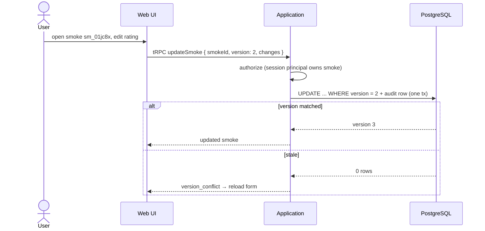

# Flow: Edit a Smoke

- **Trigger:** correction after the fact — on the website, or
  conversationally ("actually that was the Robusto", "change my rating
  to 90").

## Website edit

## Conversational edit

The model resolves the target via conversation context or `get_my_smokes`
(fetching full detail with `get_smoke` when the correction depends on
current values), then calls `update_smoke` with the mutation envelope and
explicit `changes` operations (see tool contract) — never a generic patch.
`expectedVersion` is optional: supplied → checked (`version_conflict` is
recoverable via `get_smoke`); omitted → targeted fields, last-write-wins,
audit-trailed (ADR-002 rationale). Retries reuse the same
`clientRequestId`, so a lost response can't double-apply an append.

## Invariants

- Ownership checked on every mutation; audit row in the same transaction
  records actor (web session vs MCP client), before/after, and correlation
  id.
- `appendProgression` only appends — conversational history is never
  rewritten by an edit.
- Imported Smokes: structured fields editable; original markdown immutable.
- Deletion is web-only with confirmation; MCP has no delete tool.

## Failure modes

- Ambiguous target in conversation ("change that rating" with several recent
  smokes) → model asks; `get_my_smokes` output gives ids to disambiguate.
- `version_conflict` → re-read (form reload / `get_smoke`) and re-apply;
  never silent overwrite.
