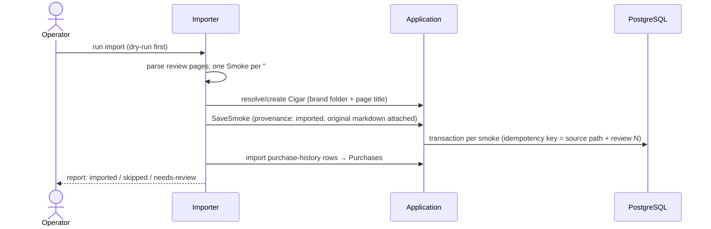

# Flow: Legacy Import

- **Trigger:** one-shot migration of `archive/` (Phase 2), run as a batch
  job by an operator. Format spec:
  [`.agents/reference/archive-format.md`](../../.agents/reference/archive-format.md).

## Sequence

## Rules

- **Never fabricate.** Original prose is preserved verbatim on the Smoke;
  the review-heading date becomes `smokedAt { value, source:
  legacy-document, precision: day }` (or `source: unknown` with null value);
  vitola from the heading; rating from the brand-index table when present.
  Everything else is null — sparse historical Smokes are first-class in the
  domain (ADR-002 minimum validity). No synthesized progression stages —
  legacy prose wasn't written in stages, and inventing them would corrupt
  analytics; structured parsing of prose is optional later curation, never
  an import-time guess.
- **Provenance:** `imported`, with source repo path and import timestamp;
  original markdown stored immutably on the Smoke and rendered on its page.
- **Idempotent + re-runnable:** deterministic keys from source path + review
  number; a re-run after a parser fix updates structured fields but never
  duplicates.
- **Data quirks** (archive-format spec): drifting index headers, brand-name
  drift ("LFD", "Rockey Patel"), mixed date formats, placeholder purchase
  values (`TBD`, `Backordered`) → import as null + `needs-review` flag, fixed
  in the curation queue, not by the importer guessing.
- All imported records owned by the owner's user; his journal is public, so
  the ledger's public visibility carries over.

## Failure modes

- Unparseable page → skipped with a line in the report; the archive is small
  enough to fix by hand and re-run.
- Ambiguous cigar match → created as `unverified` + `needs-review` rather
  than guessing a merge.
