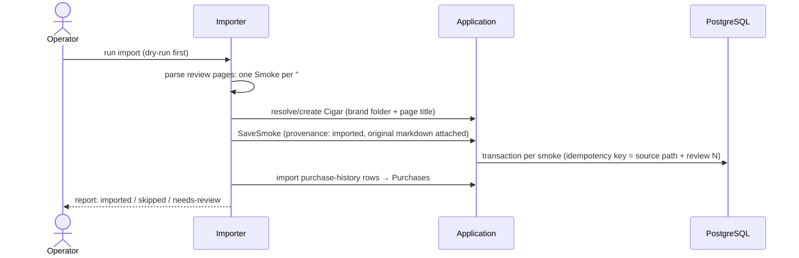

# Flow: Legacy Import

- **Trigger:** one-shot migration of `archive/` (Phase 2), run as a batch
  job by an operator. Format spec:
  [`.agents/reference/archive-format.md`](../../.agents/reference/archive-format.md).

## Sequence

## Rules

- **Never fabricate.** Original prose is preserved verbatim on the Smoke;
  the review-heading date becomes `smokedAt { value, source:
  legacy-document, precision: day }` (or `source: unknown` with null value);
  vitola from the heading; rating from the brand-index table when present.
  Everything else is null — sparse historical Smokes are first-class in the
  domain (ADR-002 minimum validity). No synthesized progression stages —
  legacy prose wasn't written in stages, and inventing them would corrupt
  analytics; structured parsing of prose is optional later curation, never
  an import-time guess.
- **Provenance:** `imported`, with source repo path and import timestamp;
  original markdown stored immutably on the Smoke and rendered on its page.
- **Idempotent + re-runnable:** deterministic keys from source path + review
  number; a re-run after a parser fix updates structured fields but never
  duplicates.
- **Data quirks** (archive-format spec): drifting index headers, brand-name
  drift ("LFD", "Rockey Patel"), mixed date formats, placeholder purchase
  values (`TBD`, `Backordered`) → import as null + `needs-review` flag, fixed
  in the curation queue, not by the importer guessing.
- All imported records owned by the owner's user; his journal is public, so
  the ledger's public visibility carries over.

## Ledger reconcile (second pass)

After the archive import, the `ledger` subcommand reconciles the owner's
verbatim spreadsheet export (`archive/ledger/purchases-*.csv`, a superset of the
archive purchase table) against what was already imported, inserting only the
delta:

- **Match = skip.** A ledger row matches an already-imported purchase when the
  normalized cigar name+brand, purchase date, quantity, and packaging line up
  (name identity is the unordered {brand, cigar} pair, since the raw sheet and
  the hand-cleaned archive table swap those two columns for the Cuban half).
  Matched rows are reported, never re-written. Matching is against the archive
  `purchase-history.md` source rows, not the DB purchase→cigar links, because
  the importer's trigram cigar resolution collapses near-identical names and the
  link can no longer identify a purchase's original name.
- **Unmatched = insert once.** Written through the same idempotency-enveloped
  purchase writer as the archive import (never a second write path), under
  deterministic `ledger-<snapshot-date>#<row-ordinal>` keys so a re-run replays
  instead of duplicating. Existing rows are never updated or deleted.
- **No fabrication (same rules).** `Rockey Patel` (and other known aliases)
  import literally + `needs-review` for a curator merge; brand `???` → unknown
  (null brand), the cigar created `unverified` only when a name exists; status
  words (`Backordered`/`Stuck`) → null + note; a present-but-malformed size →
  null + note (never guessed); blank vitola/size on Cuban rows → null silently;
  `Aging` free text is carried verbatim into the purchase's notes.

Dry-run is the default (prints the matched / insert / needs-review plan);
`--apply` executes.

## Failure modes

- Unparseable page → skipped with a line in the report; the archive is small
  enough to fix by hand and re-run.
- Ambiguous cigar match → created as `unverified` + `needs-review` rather
  than guessing a merge.
- Ledger row whose brand/cigar naming genuinely disagrees with the archive
  (beyond the column swap) → inserted as a faithful near-duplicate + reconciled
  later by a curator, never silently merged.
